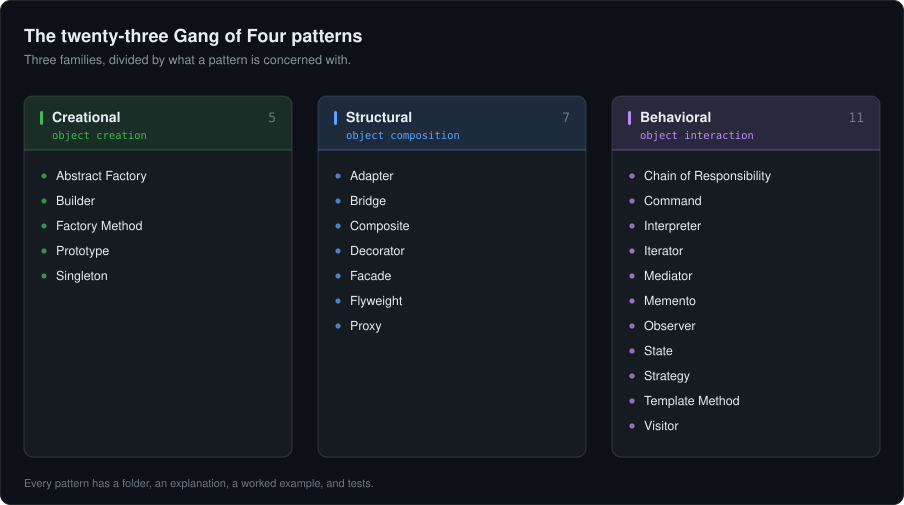

<h1 align="center">Design Patterns in .NET</h1>

<p align="center">
  The twenty-three Gang of Four design patterns, implemented in C# on .NET 10,<br>
  one folder per pattern, each with an explanation, a worked example, and tests.
</p>

<p align="center">
  <a href="https://github.com/engineering87/dotnet-design-patterns/actions/workflows/build.yml"></a>
  <a href="https://opensource.org/licenses/MIT"></a>
  <a href="https://dotnet.microsoft.com/"></a>
  <a href="https://dotnet.microsoft.com/languages/csharp"></a>
  <a href="https://github.com/engineering87/dotnet-design-patterns/issues"></a>
  <a href="https://github.com/engineering87/dotnet-design-patterns/stargazers"></a>
</p>

---

Each pattern gets its own folder holding three things: a README explaining the problem it solves and when it is the wrong answer, a small example in idiomatic C#, and tests that exercise that example. All the examples draw on the same domain, a file system, so you can compare one pattern against another instead of against twenty-three unrelated toy problems.

## Contents

- [Quickstart](#quickstart)
- [The catalogue](#the-catalogue)
  - [Creational patterns](#creational-patterns)
  - [Structural patterns](#structural-patterns)
  - [Behavioral patterns](#behavioral-patterns)
- [Choosing a pattern](#choosing-a-pattern)
- [What design patterns are](#what-design-patterns-are)
- [Why they are worth knowing](#why-they-are-worth-knowing)
- [Patterns and anti-patterns](#patterns-and-anti-patterns)
- [Design patterns in .NET](#design-patterns-in-net)
- [.NET mapping cheatsheet](#net-mapping-cheatsheet)
- [Repository layout](#repository-layout)
- [Diagrams](#diagrams)
- [Tests](#tests)
- [Contributing](#contributing)
- [Further reading](#further-reading)
- [License](#license)
- [Contact](#contact)

## Quickstart

The solution targets .NET 10, the current long term support release, so install the [.NET 10 SDK](https://dotnet.microsoft.com/download) first.

```bash
git clone https://github.com/engineering87/dotnet-design-patterns.git
cd dotnet-design-patterns

# The solution lives under src
dotnet build src/DotnetDesignPatterns.sln
dotnet test  src/DotnetDesignPatterns.sln
```

There is no console entry point to run. The tests are the executable form of the examples, so `dotnet test` is the fastest way to see every pattern do its work. To follow one pattern in isolation, filter by its test class:

```bash
dotnet test src/DotnetDesignPatterns.sln --filter FullyQualifiedName~MediatorTests
```

## The catalogue

The Gang of Four split the catalogue into three families. Creational patterns deal with making objects, structural patterns with arranging them, and behavioral patterns with how objects talk to each other.

<p align="center">
  
</p>

### Creational patterns

Creational patterns are concerned with how objects come into existence. They put the instantiation behind an abstraction, so that the calling code depends on what it needs rather than on a concrete type. See the [category notes](src/DotnetDesignPatterns/Creational/README.md).

| Pattern | Intent |
| --- | --- |
| **[Abstract Factory](src/DotnetDesignPatterns/Creational/AbstractFactory/README.md)** | Provide an interface for creating families of related or dependent objects without naming their concrete classes. |
| **[Builder](src/DotnetDesignPatterns/Creational/Builder/README.md)** | Separate the construction of a complex object from its representation, so that the same process can produce different representations. |
| **[Factory Method](src/DotnetDesignPatterns/Creational/Factory/README.md)** | Define an interface for creating an object, and let the implementation decide which class to instantiate. |
| **[Prototype](src/DotnetDesignPatterns/Creational/Prototype/README.md)** | Create new objects by copying an existing instance rather than building one from scratch. |
| **[Singleton](src/DotnetDesignPatterns/Creational/Singleton/README.md)** | Ensure that a class has one instance only, and provide a single point of access to it. |

### Structural patterns

Structural patterns are concerned with how classes and objects are put together into larger structures, and with keeping those structures flexible as they grow. See the [category notes](src/DotnetDesignPatterns/Structural/README.md).

| Pattern | Intent |
| --- | --- |
| **[Adapter](src/DotnetDesignPatterns/Structural/Adapter/README.md)** | Let two incompatible interfaces work together by wrapping one of them. |
| **[Bridge](src/DotnetDesignPatterns/Structural/Bridge/README.md)** | Separate an abstraction from its implementation so that the two can vary independently. |
| **[Composite](src/DotnetDesignPatterns/Structural/Composite/README.md)** | Compose objects into tree structures, and let clients treat a leaf and a branch the same way. |
| **[Decorator](src/DotnetDesignPatterns/Structural/Decorator/README.md)** | Attach responsibilities to an object at run time, without changing its class. |
| **[Facade](src/DotnetDesignPatterns/Structural/Facade/README.md)** | Provide one entry point to a set of interfaces in a subsystem. |
| **[Flyweight](src/DotnetDesignPatterns/Structural/Flyweight/README.md)** | Share fine grained objects so that a large number of them can be held efficiently. |
| **[Proxy](src/DotnetDesignPatterns/Structural/Proxy/README.md)** | Provide a stand in for another object in order to control access to it or to defer its cost. |

### Behavioral patterns

Behavioral patterns are concerned with how objects communicate, and with how responsibility is distributed among them. See the [category notes](src/DotnetDesignPatterns/Behavioral/README.md).

| Pattern | Intent |
| --- | --- |
| **[Chain of Responsibility](src/DotnetDesignPatterns/Behavioral/ChainOfResponsibility/README.md)** | Pass a request along a chain of handlers until one of them handles it. |
| **[Command](src/DotnetDesignPatterns/Behavioral/Command/README.md)** | Turn a request into an object, so that it can be queued, logged, or undone. |
| **[Interpreter](src/DotnetDesignPatterns/Behavioral/Interpreter/README.md)** | Define a representation for the grammar of a language, together with an interpreter for it. |
| **[Iterator](src/DotnetDesignPatterns/Behavioral/Iterator/README.md)** | Provide sequential access to the elements of an aggregate without exposing how it is stored. |
| **[Mediator](src/DotnetDesignPatterns/Behavioral/Mediator/README.md)** | Put the rules of interaction between a set of objects into one object. |
| **[Memento](src/DotnetDesignPatterns/Behavioral/Memento/README.md)** | Capture the internal state of an object so that it can be restored later, without breaking encapsulation. |
| **[Observer](src/DotnetDesignPatterns/Behavioral/Observer/README.md)** | Define a one to many dependency, so that dependents are notified when the subject changes. |
| **[State](src/DotnetDesignPatterns/Behavioral/State/README.md)** | Let an object change its behaviour when its internal state changes, as though it changed class. |
| **[Strategy](src/DotnetDesignPatterns/Behavioral/Strategy/README.md)** | Define a family of algorithms, put each one behind the same interface, and make them interchangeable. |
| **[Template Method](src/DotnetDesignPatterns/Behavioral/TemplateMethod/README.md)** | Define the skeleton of an algorithm, and defer some of its steps to subclasses. |
| **[Visitor](src/DotnetDesignPatterns/Behavioral/Visitor/README.md)** | Represent an operation to be performed on the elements of an object structure, without changing their classes. |

## Choosing a pattern

Applying a pattern is a trade. You gain flexibility along one axis and pay for it with indirection everywhere else. Before reaching for one, check that the flexibility it gives you is flexibility you will actually use.

| Pattern | Category | Reach for it when | Leave it alone when |
| --- | --- | --- | --- |
| **[Abstract Factory](src/DotnetDesignPatterns/Creational/AbstractFactory/README.md)** | Creational | You need families of related objects and the family has to stay consistent. | A handful of objects is enough and family consistency is not a concern. |
| **[Builder](src/DotnetDesignPatterns/Creational/Builder/README.md)** | Creational | An object is assembled step by step, or in several representations. | The object is simple and a constructor expresses it clearly. |
| **[Factory Method](src/DotnetDesignPatterns/Creational/Factory/README.md)** | Creational | The choice of concrete type belongs to the implementation rather than the caller. | The concrete type is fixed and no flexibility is needed. |
| **[Prototype](src/DotnetDesignPatterns/Creational/Prototype/README.md)** | Creational | Copying an existing instance is cheaper or simpler than constructing one. | Objects are cheap to construct, or copying them correctly is harder than building them. |
| **[Singleton](src/DotnetDesignPatterns/Creational/Singleton/README.md)** | Creational | Exactly one instance must exist and be reachable from anywhere. | The shared state would hide dependencies or make testing harder. Prefer a container registered lifetime. |
| **[Adapter](src/DotnetDesignPatterns/Structural/Adapter/README.md)** | Structural | You have to reconcile an interface you do not control with the one you need. | You control both sides and can converge on a common interface instead. |
| **[Bridge](src/DotnetDesignPatterns/Structural/Bridge/README.md)** | Structural | The abstraction and the implementation each have their own axis of change. | The hierarchy is stable and the two axes will not diverge. |
| **[Composite](src/DotnetDesignPatterns/Structural/Composite/README.md)** | Structural | The data is a part and whole hierarchy that clients should traverse uniformly. | The structure is flat, so the extra indirection buys nothing. |
| **[Decorator](src/DotnetDesignPatterns/Structural/Decorator/README.md)** | Structural | Behaviour has to be added in layers, and the combination is chosen at run time. | The layering would make the call stack hard to follow or debug. |
| **[Facade](src/DotnetDesignPatterns/Structural/Facade/README.md)** | Structural | A subsystem is wide and most callers need a small, coherent slice of it. | The wrapper would hide behaviour that callers legitimately need. |
| **[Flyweight](src/DotnetDesignPatterns/Structural/Flyweight/README.md)** | Structural | Many objects differ only in a small part of their state. | The objects are genuinely distinct, so nothing can be shared. |
| **[Proxy](src/DotnetDesignPatterns/Structural/Proxy/README.md)** | Structural | Access control, lazy creation, caching, or a remote call sits in front of the real object. | The indirection adds cost without adding control. |
| **[Chain of Responsibility](src/DotnetDesignPatterns/Behavioral/ChainOfResponsibility/README.md)** | Behavioral | Several handlers may deal with a request and the sender should not know which one does. | The routing has to be explicit and predictable. |
| **[Command](src/DotnetDesignPatterns/Behavioral/Command/README.md)** | Behavioral | You need undo, redo, queueing, or an audit trail of operations. | A direct method call says the same thing with less machinery. |
| **[Interpreter](src/DotnetDesignPatterns/Behavioral/Interpreter/README.md)** | Behavioral | The grammar is small and stable, and the expressions are short. | The grammar is large. Use a parser generator or an existing expression library. |
| **[Iterator](src/DotnetDesignPatterns/Behavioral/Iterator/README.md)** | Behavioral | Traversal has to be decoupled from the underlying representation. | The built in enumeration of the collection already covers the need. |
| **[Mediator](src/DotnetDesignPatterns/Behavioral/Mediator/README.md)** | Behavioral | The objects would otherwise reference one another in a dense web. | The interaction is simple, so the mediator only adds a hop. |
| **[Memento](src/DotnetDesignPatterns/Behavioral/Memento/README.md)** | Behavioral | State has to be saved and rolled back from outside the object. | The snapshots would be too large or too frequent to be affordable. |
| **[Observer](src/DotnetDesignPatterns/Behavioral/Observer/README.md)** | Behavioral | Several parties need to react to a change in one place. | The notification rate would cause cascading or unpredictable updates. |
| **[State](src/DotnetDesignPatterns/Behavioral/State/README.md)** | Behavioral | Behaviour depends on a state machine with several states and transitions. | Two states and one condition express the same thing more plainly. |
| **[Strategy](src/DotnetDesignPatterns/Behavioral/Strategy/README.md)** | Behavioral | The algorithm is selected at run time, or has to be swapped for testing. | One algorithm exists and there is no prospect of another. |
| **[Template Method](src/DotnetDesignPatterns/Behavioral/TemplateMethod/README.md)** | Behavioral | The sequence of steps is fixed while individual steps vary. | Inheritance would make the design rigid. Composition may serve better. |
| **[Visitor](src/DotnetDesignPatterns/Behavioral/Visitor/README.md)** | Behavioral | New operations are added often, while the set of element types is stable. | The set of element types changes often, so every visitor has to change with it. |

## What design patterns are

A design pattern is a named solution to a problem that keeps coming up in object oriented design. It describes the shape a solution tends to take, in enough detail that two engineers who both know the name can skip half an hour of explanation. You still write the code yourself.

The catalogue used here comes from *Design Patterns: Elements of Reusable Object-Oriented Software*, published in 1994 by Erich Gamma, Richard Helm, Ralph Johnson, and John Vlissides. The four authors are usually called the Gang of Four, and the twenty-three patterns they catalogued are still the common vocabulary of the field.

## Why they are worth knowing

1. **A shared vocabulary.** Calling a class a decorator tells another engineer its structure, its intent, and its constraints without any further explanation. This is the part that carries over to any language or framework.
2. **Solutions with a track record.** Each pattern has been applied and misapplied across three decades. The ways one goes wrong are documented alongside the ways it goes right, and that documentation is often the more useful half.
3. **Boundaries that hold.** Most patterns work by naming a seam in the design: a strategy, a state, a handler. A named seam is easier to change later than an unnamed one.
4. **Recognition in the frameworks you already use.** ASP.NET Core, `IEnumerable<T>`, `IObservable<T>`, and the dependency injection container are all built out of these shapes. Knowing the names makes the framework legible.

The counterweight is worth stating plainly. Applying a pattern where the problem does not call for it produces indirection with no payoff, and that is a common way for a codebase to become hard to read. Reach for a pattern when the pressure it relieves is one you are feeling.

## Patterns and anti-patterns

An anti-pattern is a response to a recurring problem that looks reasonable and turns out to be costly.

| | Design patterns | Anti-patterns |
| --- | --- | --- |
| **Origin** | Taken from solutions that held up in production over time | Adopted under time pressure, or copied without the context around them |
| **Effect over time** | The design stays open to the change it anticipated | The design hardens around a decision nobody meant to make |
| **Recognisable by** | A named seam, and a reason for it | Indirection with no beneficiary, or state with no owner |

The usual causes are familiar: a deadline that rewards the first solution over the right one, a design decision taken by one person and never explained, and a shortcut copied into a second place before anybody notices it was a shortcut.

## Design patterns in .NET

C# and the .NET runtime express several of these patterns natively, so an implementation that follows the 1994 class diagram literally is often more elaborate than the language requires. Delegates make a strategy a one line affair, `yield return` makes an iterator disappear into the compiler, and the dependency injection container in `Microsoft.Extensions.DependencyInjection` covers most of what a factory used to do by hand. C# 14 continues that direction: extension members let a set of operations be attached to a type from the outside, which covers part of the ground that a thin adapter or decorator used to occupy.

The examples here follow the classical class structure, because that structure is what a pattern teaches. The table below is the practical counterpart: it shows the shortcut you would actually take in production, once the idea is clear.

## .NET mapping cheatsheet

| Pattern | The .NET way |
| --- | --- |
| Singleton | `IServiceCollection.AddSingleton<T>()`, `Lazy<T>` |
| Strategy | An interface plus dependency injection, selected at run time with keyed services or a factory delegate |
| Observer | `IObservable<T>` and `IObserver<T>`, C# events, `IChangeToken` |
| Decorator | Layered registrations, or `Scrutor` for service decoration |
| Adapter | A wrapper over an external SDK, or a custom `HttpMessageHandler` |
| Factory Method, Abstract Factory | `IServiceProvider`, a factory delegate such as `Func<T>` |
| Command | A request and handler pair, for example `IRequestHandler<>` in MediatR |
| Iterator | `IEnumerable<T>` and `yield return` |
| Template Method | A base class with `virtual` steps |
| Proxy | `HttpClient` and generated clients, or a dynamic proxy through `DispatchProxy` or Castle |
| Composite | A tree of `IEnumerable<T>` nodes, and `ILogger` composition over multiple providers |
| Mediator | MediatR, or an in process message bus |

One caveat on extension members. They attach members to a type you do not own, which looks a lot like an adapter, but they do not make that type implement an interface. If you need the type to satisfy a contract it does not declare, you still need a real adapter.

## Repository layout

```
dotnet-design-patterns
├── src
│   ├── DotnetDesignPatterns.sln
│   ├── Directory.Build.props          # settings shared by every project
│   ├── DotnetDesignPatterns           # the implementations
│   │   ├── Creational
│   │   │   ├── README.md              # what the category is for
│   │   │   ├── AbstractFactory
│   │   │   │   ├── README.md          # the pattern, explained
│   │   │   │   └── *.cs               # the worked example
│   │   │   └── ...
│   │   ├── Structural
│   │   └── Behavioral
│   └── DotnetDesignPatterns.Tests     # mirrors the folder structure above
├── docs
│   └── diagrams                       # generated, one SVG per pattern
├── tools
│   ├── diagram_specs.py               # what each diagram contains
│   └── generate_diagrams.py           # the renderer
├── CONTRIBUTING.md
├── SECURITY.md
└── README.md
```

Every pattern folder holds one `README.md` and the classes that make up the example. The test project mirrors the same three level structure, so the tests for a pattern sit at the matching path under `src/DotnetDesignPatterns.Tests`.

## Diagrams

Each pattern README opens with a UML diagram of the classes in that example. The diagrams are generated from a declarative specification rather than drawn by hand. That keeps them consistent with each other, and it means editing a diagram produces a diff somebody can review instead of a replaced binary.

```bash
python3 tools/generate_diagrams.py
```

The build workflow runs the same script with `--check` and fails if a committed diagram no longer matches its specification.

## Tests

All twenty-three patterns are covered by tests, written with xUnit v3 and run on every push and pull request by the [build workflow](.github/workflows/build.yml).

```bash
dotnet test src/DotnetDesignPatterns.sln
```

The suite runs on Microsoft.Testing.Platform, which xUnit v3 uses natively and which the .NET 10 SDK selects through the `test` section of `global.json`. Coverage is not collected at the moment: the collector this repository used belongs to the older VSTest runner.

The tests run in parallel, because none of them touches process wide state: every class that narrates what it is doing writes to a `TextWriter` that defaults to `Console.Out`, and a test hands it a `StringWriter` of its own.

```csharp
var output = new StringWriter();
var proxy = new ResourceProxy("Admin") { Output = output };

proxy.Access();

Assert.Contains("Accessing the real resource", output.ToString());
```

## Contributing

Contributions are welcome. [CONTRIBUTING.md](CONTRIBUTING.md) describes the layout conventions, the commit message format, and what is expected of a pull request. Please also read the [Code of Conduct](CODE_OF_CONDUCT.md).

If you have found a defect or want to propose a clearer example, [open an issue](https://github.com/engineering87/dotnet-design-patterns/issues).

## Further reading

- [Design Patterns: Elements of Reusable Object-Oriented Software](https://en.wikipedia.org/wiki/Design_Patterns), the original Gang of Four catalogue.
- [Common design patterns](https://learn.microsoft.com/en-us/dotnet/standard/design-guidelines/common-design-patterns), the Microsoft .NET design guidelines.
- [Discovering the design patterns you are already using in .NET](https://learn.microsoft.com/en-us/archive/msdn-magazine/2005/july/discovering-the-design-patterns-you-re-already-using-in-net), an MSDN Magazine article on the patterns built into the framework itself.
- [Dependency injection in .NET](https://learn.microsoft.com/en-us/dotnet/core/extensions/dependency-injection), which subsumes several creational patterns in modern code.

## License

Released under the MIT License. See [LICENSE](LICENSE).

## Contact

Francesco Del Re, francesco.delre.87[at]gmail.com
